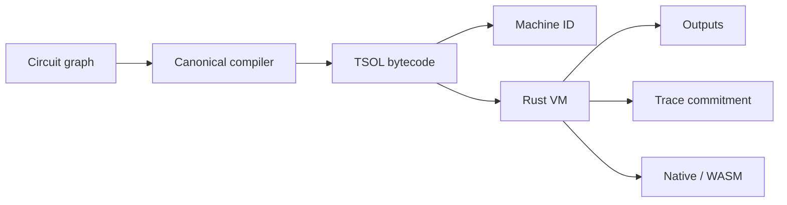

# NANDRY Core

> Build a machine once. Reproduce it byte for byte. Execute it anywhere.

[](https://github.com/NandryAI/nandry-core/actions/workflows/ci.yml)
[](rust-toolchain.toml)
[](LICENSE)
[](https://nandry.com)

NANDRY is a deterministic machine layer built from the smallest useful computational substrate: **NAND gates and one-bit memory**.

It turns a circuit graph into canonical TSOL bytecode, assigns that machine a stable cryptographic identity, executes it through a single Rust runtime, and commits its state transitions into a reproducible trace.

The same machine means the same bytes, the same Machine ID, and the same execution semantics—whether it runs natively or through WebAssembly.

## The idea

At the bottom of every computer is a very small language.

Boolean logic can be reduced to NAND. Stateful computation requires only that logic plus memory. Everything above it—processors, virtual machines, compilers, protocols—is composition.

NANDRY takes that fact literally.

A machine is not treated as a diagram, a source repository, or a platform-specific executable. It is treated as a **canonical computational artifact**:



This gives machines three properties that ordinary programs rarely have:

- **Canonical identity** — equivalent graph declarations compile to identical bytes.
- **Portable semantics** — native and browser execution share the same Rust implementation.
- **Commitment-native execution** — inputs, outputs, machine definitions, and traces have versioned cryptographic identities.

The bet behind NANDRY is simple:

> Once computation has a canonical and executable identity, it stops being an implementation detail and becomes durable infrastructure.

## What exists today

NANDRY Core contains a complete vertical slice from logic graph to running machine:

- A deterministic graph compiler.
- A compact binary netlist format: TSOL v1.
- A `no_std`, allocation-free virtual machine.
- Versioned Machine IDs and execution commitments.
- Per-tick state and output trace commitments.
- WebAssembly bindings backed by the same Rust VM.
- A gate-level 8-bit CPU constructed entirely from NAND and LATCH primitives.
- Golden execution vectors shared across runtime boundaries.
- Canonicalization and reproducibility tests.

There is one implementation of netlist encoding, machine identity, and execution semantics: Rust.

## A computer made of gates

The reference 8-bit CPU is assembled using the same public circuit builder, compiler, bytecode format, and VM exposed by the workspace.

```text
NAND gates     1,354
LATCH gates       51
Total gates     1,405
TSOL bytecode   9,863 bytes
```

It has four 8-bit registers, arithmetic and logical operations, conditional branches, program output, and halt state.

The machine currently runs:

```text
Fibonacci       0 1 1 2 3 5 8 13 21 34 55 89
13 × 17         221
gcd(84, 30)     6
```

Run it directly:

```bash
cargo run -p nandry-circuits --example cpu_report --release
```

The CPU is more than a demo. It is a composition test for the entire system: sequential feedback, arithmetic, control flow, canonical compilation, bit-packed state, and thousands of gates executing under one deterministic semantic model.

## TSOL: a machine in bytes

TSOL v1 is a compact forward netlist format for synchronous NAND/LATCH machines.

Its fixed header is 28 bytes:

| Offset | Size | Field |
|---:|---:|---|
| 0 | 4 | `TSOL` magic |
| 4 | 1 | format version |
| 5 | 1 | flags |
| 6 | 2 | reserved |
| 8 | 4 | input bit count |
| 12 | 4 | output bit count |
| 16 | 4 | gate count |
| 20 | 4 | latch count |
| 24 | 4 | gate body length |

The output table contains little-endian u24 signal indexes. The gate body has two instructions:

```text
NAND  = 0x00 || a:u24 || b:u24
LATCH = 0x01 || d:u24
```

Signals 0 and 1 are constants. Inputs follow, then one signal per gate.

NAND operands may only reference earlier signals. Latches form a canonical prefix and may sample any valid signal, allowing sequential feedback without admitting combinational cycles.

The format has no ambiguous encodings, optional fields, or runtime-dependent ordering.

Read the complete [TSOL v1 specification](docs/tsol-v1.md).

## Determinism is the product

Reproducibility is not added after compilation. It determines the design of the compiler.

NANDRY uses ordered graph structures and deterministic topological traversal. Node declarations and connection declarations may be reordered without changing the emitted bytecode.

```text
same logical graph
        ↓
same TSOL bytes
        ↓
same circuit digest
        ↓
same Machine ID
        ↓
same execution semantics
```

The compiler tests graph permutations directly. Golden vectors lock parser and execution behavior. Machine Spec v1 contains fixed digest vectors so accidental encoding changes fail loudly.

The long-term standard is stronger than “works on my machine”:

> Independent systems should be able to construct the same machine and arrive at the same Machine ID without coordination.

## Machine Spec v1

A Machine ID is SHA-256 over a canonical 64-byte structure containing:

- The `NDRYMCH1` domain separator.
- Machine Spec version.
- TSOL VM version.
- Execution mode.
- Circuit digest.
- Input and output dimensions.
- Gate and latch counts.

```text
machine_id = SHA256(canonical_machine_spec_v1)
```

Machine identity binds executable meaning—not filenames, build paths, object addresses, or host metadata.

Inputs and outputs use independent domains:

```text
NDRYINP1  machine input commitment
NDRYOUT1  machine output commitment
```

Execution traces use a chained commitment:

```text
NDRYTRC1  trace initialization
NDRYSTP1  state transition step
```

Each step binds its index, the previous root, the next latch state, and the observed output. Reordering, deleting, or modifying a step changes the final trace root.

Read [Machine Spec v1](docs/machine-spec-v1.md).

## One semantic core

The runtime is intentionally small.

`nandry-vm` is:

- `no_std`
- heap-free during parsing and execution
- caller-buffered
- free of unsafe Rust
- strict about encoded lengths
- strict about gate ordering
- strict about signal validity
- synchronous for all latch updates

Each tick follows one rule:

1. Load constants, inputs, and current latch state.
2. Evaluate gates in canonical order.
3. Read every next-state latch input.
4. Produce packed output bits.
5. Commit all latch updates simultaneously.

The VM does not infer intent or repair malformed machines. Bytes either satisfy TSOL v1 or they do not.

## Rust and WebAssembly

Browser execution is not a second implementation.

`nandry-wasm` exposes the compiler, parser, and evaluator through WebAssembly while delegating semantics to the same Rust crates used by the native runtime.

```text
encodeCircuitGraphJson
parseCircuitJson
stepCircuitBytes
```

This keeps the interface thin and the semantic surface small. A format change cannot silently drift between native and browser implementations.

Build it with:

```bash
rustup target add wasm32-unknown-unknown
cargo build \
  -p nandry-wasm \
  --target wasm32-unknown-unknown \
  --release
```

## Workspace

| Crate | Role |
|---|---|
| `nandry-compiler` | Canonical graph traversal and TSOL encoding |
| `nandry-vm` | `no_std` TSOL validation and execution |
| `nandry-ir` | Machine Spec v1 and commitment primitives |
| `nandry-trace` | Ordered execution trace commitments |
| `nandry-wasm` | Rust-to-WebAssembly interface |
| `nandry-circuits` | Logic library, circuit builder, and 8-bit CPU |

Supporting artifacts:

| Path | Role |
|---|---|
| `docs/tsol-v1.md` | TSOL binary specification |
| `docs/machine-spec-v1.md` | Machine identity and commitment specification |
| `golden/vm-v1.json` | Runtime-independent execution vectors |

## Quick start

```bash
git clone https://github.com/NandryAI/nandry-core.git
cd nandry-core

cargo test --workspace
cargo run -p nandry-circuits --example cpu_report --release
```

Run the full local quality gate:

```bash
cargo fmt --all -- --check
cargo clippy --workspace --all-targets -- -D warnings
cargo test --workspace
cargo build -p nandry-wasm \
  --target wasm32-unknown-unknown \
  --release
```

Rust 1.89.0 is pinned in `rust-toolchain.toml`.

## Design principles

NANDRY is built around a small set of non-negotiable rules:

### Bytes before objects

The durable artifact is the canonical byte sequence, not an in-memory representation.

### Semantics before optimization

A faster implementation is useful only if it produces the same observable machine.

### One source of truth

Machine hashes, netlist encoding, and execution behavior belong to the Rust core.

### Explicit state

Memory is represented by latches with synchronous transition rules. There is no implicit runtime state.

### Version everything that can become consensus

Formats, machine specifications, execution modes, and commitment domains are explicit.

### Claims must be reproducible

Gate counts, byte sizes, digest vectors, and program outputs are derived from code and locked by tests.

## Direction

NANDRY is building toward a world where machines can be published, inspected, reproduced, and executed as stable computational objects.

The technical direction includes:

- Cross-platform reproducible build fixtures.
- Property tests and adversarial parser corpora.
- Native/WASM differential execution.
- Public TSOL conformance suites.
- Larger gate-level processors and specialized machines.
- Trace verification and proof-system adapters.
- Alternative execution backends that preserve the same semantics.
- A shared library of machines addressed by Machine ID.

The compiler and VM are the foundation. Everything else should be replaceable.

## Where NANDRY fits

A canonical low-level machine representation can serve as common ground for:

- Reproducible circuit compilation.
- Deterministic emulators.
- Portable hardware models.
- Verifiable execution systems.
- Proof-oriented computation.
- Browser-native machine simulation.
- Research into minimal computing architectures.
- Long-lived computational artifacts.

NANDRY is deliberately lower-level than an application runtime and higher-level than physical silicon. It defines the point where a logical machine becomes a stable executable identity.

## Contributing

The most valuable contributions attack the hard parts:

- Find a graph that breaks canonical ordering.
- Construct malformed TSOL that passes validation.
- Add property tests around parser and evaluator invariants.
- Build differential tests for another runtime target.
- Reduce the gate count of an existing circuit.
- Add a machine that stresses sequential semantics.
- Tighten the specifications where behavior is ambiguous.

If two reasonable implementations could disagree, the specification is not finished.

## License

Apache-2.0.

---

**NANDRY Core**

Canonical machines. Deterministic execution. Computation that keeps its identity.
